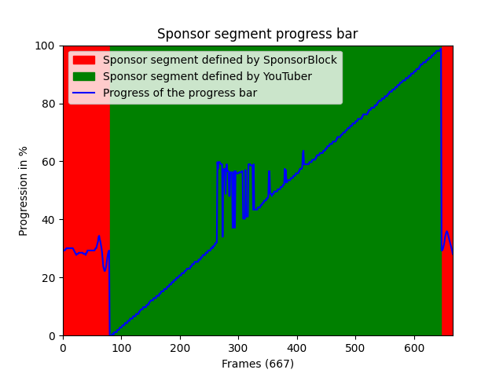

# YouTube sponsor progress bar checker

A python script to check the progress of progress bars in YouTube videos

## Why?

Good question... I blame Matt Parker from [Stand-up Maths](https://www.youtube.com/@standupmaths). He released a video where he looked at the progress of progress bars in various YouTube videos. However he did a lot manually. This is why this project exists. My program isn't necessarily better, but it is pretty much hands free

Here is an example for the first sponsor segment in [Matt's video](https://www.youtube.com/watch?v=uc0OU1yJD-c)!



## How to run the script

First make sure you have the [SponsorBlock database](https://github.com/mchangrh/sb-mirror)

Then either move the `sponsorTimes.csv` to the base directory or edit your `config.json` and set `sponsorblockDatabasePath` to the full path of the `sponsorTimes.csv` file

### Edit your `config.json`

> [!NOTE]
> I may add command line arguments at some point, but for now you have to edit the `config.json` file

Set `searchType` to either 0, 1 or 2

0 will take the first few videos from the channel you put in `channelID`, `channelURLs` or `channelUsernames`

1 will use the videoIDs or videoURLs you put in `videoIDs` and `videoURLs`

2 will search YouTube for whatever you put in `search`

At this point you should be ready to go

> [!WARNING]
> I have only tested this on Linux! If you are on macOS you should be fine. But if you are on Windows, you may want to edit `getVideoid` and `getHead` in `commandlineTools` in your `config.json`

### Requirements

To install all the requirements, simply run:

```
pip install -r requirements.txt
```

### Running

To run the script:

```
python main.py
```


That's all! Have fun!
